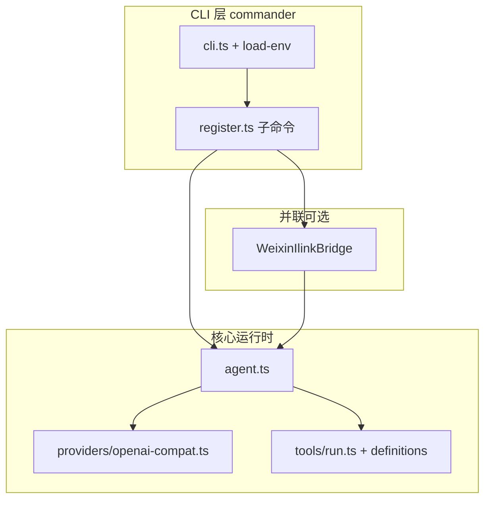

# nanobot（TypeScript）功能与架构原理

本文档描述本仓库**如何实现**终端 Agent、LLM 调用、工具执行与微信通道，便于二次开发与排障。与 [HKUDS/nanobot](https://github.com/HKUDS/nanobot) 的差异以 `src/nanobot/PARITY.ts` 为准。

---

## 1. 总体架构

- **单入口**：`src/cli.ts` 首先 `import ./load-env.js`，确保任何模块读取 `process.env` 前已加载 `.env`。
- **默认子命令**：`agent`（交互或 `-m`），由 `cmdAgent.ts` 调用 `runAgentLoop` / `runAgentMessage`。
- **配置单一来源**：磁盘 `nanobot.config.json` 与 `defaultConfig()` 深度合并（`config.ts`），**JSON 覆盖代码默认**。

---

## 2. 配置加载与路径解析

### 2.1 配置文件位置

- 默认：`repoRoot()/nanobot.config.json`，其中 `repoRoot()` 由 **`dist/cli.js` 或 `src/config.ts` 所在位置**相对推导到工程根（与 `package.json` 同级）。
- 覆盖：环境变量 `NANOBOT_CONFIG`（绝对路径或相对 **当前工作目录**）。

### 2.2 合并语义

`normalizeConfig(mergeDeep(defaults, parsed))`：

- 顶层与嵌套对象递归合并；数组与标量由 patch 侧覆盖。
- 因此用户若在 JSON 中写了 `channels.weixin.enabled: false`，即使用户修改了 `defaultConfig()` 里的默认 `true`，运行时仍以 **JSON 为准**。

### 2.3 密钥解析（`openai-compat.ts`）

解析顺序概要：

1. 若同时存在 `NANOBOT_API_KEY` 与 `NANOBOT_PROVIDER`，则使用该组合（provider 必须在 `providers` 中存在）。
2. 否则取 `agents.defaults.provider`，使用 `providers.<name>.apiKey`；若为空，则按该 provider 的**环境变量列表**（如 `MOONSHOT_API_KEY`）查找。
3. 若仍无密钥，尝试在其它内置 provider id 上找**环境变量**中的密钥并打印提示（fallback）。

`createClient(config)` 返回 `{ client, providerName, baseURL }`，供 Agent 与错误诊断使用。

---

## 3. 记忆模块（`nanobot/memory/memoryStore.ts`）

- **静态**：`workspaceRoot/MEMORY.md` 按 `## 标题` 解析为块，在 `agents.memory.enabled !== false` 时拼入 **system** 前缀。
- **会话**：每次 user→assistant 完成后，将本轮纯文本追加到 `<repo>/.nanobot-runtime/memory/sessions/<sanitizedSessionKey>.json` 的 `transcript` 数组，并截断至 `maxPersistedMessages`。
- **冷启动 / 单条消息**：`buildFullSystemPrompt` 将 MEMORY.md 与会话 JSON 中的摘录一并写入 system，使 `pnpm start` 重开或微信下一条消息能读到上轮摘要。
- **REPL 当前进程**：`messages[]` 仍保留完整多轮（含工具）；持久化仅保存「最后一轮可见 assistant 文本」，避免把 tool 原始 JSON 塞进记忆文件。
- **`/new`**：删除本会话 JSON 并重置 system（仅 MEMORY.md 仍生效）。

---

## 4. Agent：模型与工具闭环

### 3.1 入口

- `runAgentLoop`：readline 循环，维护 `messages[]`（含 `system` 与多轮 user/assistant/tool）。
- `runAgentMessage`：单轮 user + 可选多轮工具，用于 `-m` 与微信入站。

### 3.2 一轮请求（`runModelToolRounds`）

对每个用户回合，在循环中重复：

1. 调用 `chat.completions.create`：
   - `model`：`effectiveChatModel`（Moonshot 下若 model 含 `/` 会强制回落到 `kimi-k2.5` 并告警）。
   - `tools`：由 `toolDefinitions(allowShell, allowWrite)` 生成；`tool_choice: "auto"`。
   - `temperature`：`moonshot` 为 `1`，其它 provider 为 `0.2`（满足 Kimi 部分模型的 API 约束）。
2. 若返回 **无 `tool_calls`**：将 assistant 文本写出，结束本用户回合。
3. 若有 **`tool_calls`**：对每个 function call 解析 JSON 参数，执行 `runTool(name, args, policy)`，将 `role: "tool"` 消息追加到 `messages`，**再次请求模型**（最多 `MAX_MODEL_ROUNDS` 轮）。

该模式与上游「Agent Loop」一致：**模型决定是否调用工具**，而非硬编码固定流水线。

### 3.3 系统提示（`SYSTEM`）

在 `agent.ts` 中定义，强调：

- 与仓库相关时应优先 `list_dir` / `search_repo` / `read_file`；
- `write_file` 仅在需要改文件时使用，且受路径策略约束；
- `run_shell` 默认视为不可用，除非配置开启。

### 3.4 REPL 斜杠命令（`slashRouter.ts`）

以 `/` 开头的输入在送模型前被拦截：

- `/new`：清空除 system 外的消息。
- `/status`：打印配置路径、session 占位、workspace、provider/model。
- `/exit`、`exit` 等：退出循环。
- `/stop`、`/restart`：stub 说明。

---

## 5. 工具层原理与安全边界

### 4.1 工具列表（`tools/definitions.ts`）

| 工具 | 作用 |
|------|------|
| `read_file` | 读 UTF-8 文本，超长截断 |
| `list_dir` | 列目录 |
| `search_repo` | 子串搜索，跳过 `node_modules` 等目录，有文件数与单行上限 |
| `write_file` | 写文件（可建父目录）；`allowWrite === false` 时不注册 |
| `run_shell` | 仅 `allowShell === true` 时注册 |

### 4.2 执行（`tools/run.ts`）

- **`assertInsideWorkspace`**：任何相对路径解析后必须在 workspace 根之下，防止 `../` 逃逸。
- **`writeGuard`**：在路径合法的前提下，再拒绝写入敏感文件模式（环境变量、私钥文件名、微信 `account.json`、证书后缀等）。
- **`run_shell`**：`spawn` 使用 `cmd.exe /c`（Windows）或 `sh -lc`（Unix），工作目录为 workspace 根。

### 4.3 策略对象 `ToolPolicy`

由 `nanobot.config.json` 的 `tools` 与 CLI 选项（`--allow-shell`）及 `NANOBOT_WORKSPACE` 等组合而成，在 `runAgentLoop` / `runAgentMessage` 中构造，传入每次 `runTool`。

---

## 6. 错误处理（LLM API）

`providers/apiErrors.ts` 将 OpenAI SDK 错误转为中文说明；401 时提示检查密钥、`baseUrl` 国内/国际一致性等。聊天请求在 `runModelToolRounds` 内 try/catch，错误文本回显给用户（或微信侧作为回复的一部分）。

---

## 7. 微信 iLink 通道

### 6.1 协议角色

- 与上游 `weixin.py` 一致，对接 **`ilinkai.weixin.qq.com`（或登录返回的 `baseurl`）**。
- **非**微信 Windows 客户端 UI 自动化；仅限 iLink HTTP API：**扫码登录、长轮询 `getupdates`、文本 `sendmessage`**。

### 6.2 状态持久化（`accountState.ts`）

默认目录：`<repoRoot>/.nanobot-runtime/weixin/`。

`account.json` 保存：

- `token`（bot 会话）
- `get_updates_buf`（游标）
- `context_tokens`（按用户 id 缓存 `context_token`，回复必填）
- `base_url`（若登录响应覆盖）

### 6.3 登录流程（`WeixinIlinkBridge.login`）

1. 若配置中已有 `channels.weixin.token` 且非 `--force`，直接使用并持久化。
2. 否则尝试从磁盘加载 `account.json`。
3. 否则调用 `get_bot_qrcode` → 终端打印二维码 → 轮询 `get_qrcode_status` 直至 `confirmed`，写入 token。

### 6.4 长轮询与消息处理（`runLoop` / `pollOnce`）

1. `POST getupdates`，携带 `get_updates_buf` 与 `base_info`（含 `channel_version`）。
2. 解析 `msgs`，对每条用户文本消息：
   - 去重（`processedIds`）
   - 更新 `context_token`
   - `extractTextContent` 仅处理文本 item；图片/语音等跳过（未实现 CDN + AES）。
3. `handleInboundText`：`allow_from` 白名单过滤后调用 **`runAgentMessage`**，将回复按最大长度切分后 `sendmessage`。

### 6.5 与 REPL 并联（`agent.ts`）

当 `channels.weixin.enabled === true`：

- 在 `runAgentLoop` 中构造 `WeixinIlinkBridge`，**不 await** 地启动 `runLoop({ embedded: true })`，与 readline 共享事件循环。
- `finally` 中调用 `bridge.stop()`，结束轮询循环。
- 日志默认安静；`NANOBOT_WEIXIN_VERBOSE=1` 可打开详细日志。

### 6.6 会话冷却

服务端返回会话过期（如 err -14）时，`pauseSession()` 在一段时间内降低轮询节奏，避免打爆接口（见 `constants.ts`）。

---

## 8. Gateway 与其它子系统（stub）

`gateway/runtime.ts` 的 `startGatewayStub` **不监听端口**，仅按顺序演示：MessageBus → CronService → HeartbeatService → 打印已注册通道名。真实网关需 HTTP/WebSocket、与各通道长连接对接，见 PARITY。

`cron`、`provider login`、`channels login`（非 weixin）等多为占位，便于 CLI 形状与上游一致。

---

## 9. 构建与运行方式

- **生产路径**：`vite` 将 `src/cli.ts` 打成 **单文件** `dist/cli.js`（SSR 模式），`import.meta.url` 仍可用于定位 `repoRoot()` 旁的 `.env` / 默认配置路径。
- **开发路径**：`vite-node --watch src/cli.ts`（`npm run dev` / `start:dev`）监视源码并**重启进程**。
- **贴近 dist 的热重载**：`npm run start:reload` 运行 `scripts/reload-dist.mjs`，并行 `vite build --watch` 与 `node --watch dist/cli.js`；无额外 npm 依赖。

---

## 10. 扩展建议（与上游对齐方向）

1. **Gateway**：用 `node:http` / Fastify 实现健康检查与 webhook，并在同一进程注册 `WeixinIlinkBridge`。
2. **MCP**：将 MCP 工具映射为 OpenAI `tools` 或并行一条 Messages API 分支。
3. **会话与记忆**：持久化 `messages` 或摘要写入 `memoryStore.ts`。
4. **微信富媒体**：移植上游 CDN 下载与 AES 解密逻辑。
5. **浏览器**：可选 Playwright 工具 + `tools.allowBrowser` + URL 白名单（当前未内置）。

---

## 11. 术语对照

| 术语 | 含义 |
|------|------|
| workspace | 文件工具与 shell 的工作目录根 |
| provider | 配置中的 LLM 后端 id（openai / moonshot / openrouter） |
| iLink | 微信个人号机器人 HTTP 协议端点 |
| tool_choice auto | 由模型决定是否调用函数工具 |

---

*文档版本与代码同步维护；若行为与本文冲突，以源码为准。*
